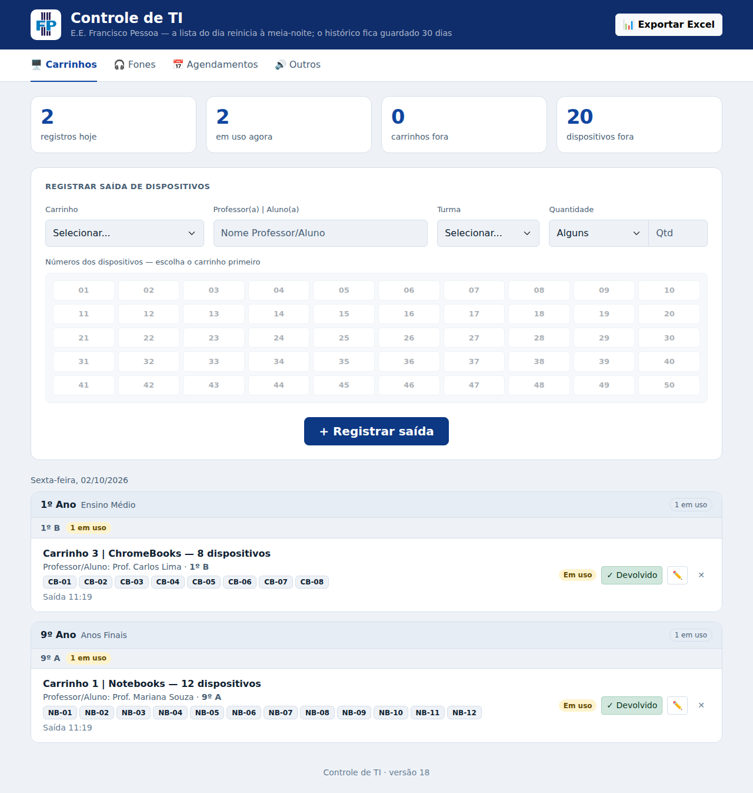

# 🖥️ Controle de TI

Sistema web para controlar a **saída e devolução de equipamentos** da sala de TI da **E.E. Francisco Pessoa**: carrinhos de notebooks, Chromebooks e tablets, fones de ouvido e outros itens.

Criado por iniciativa própria durante o estágio no **PROATI (SEDUC-SP)**, para substituir o controle feito no papel por algo rápido de usar no dia a dia da escola.

**🔗 [Ver online](https://aangelkjpn.github.io/Controle_Saida_Entrada/)** · teste direto no navegador, os dados ficam salvos só no seu computador.

<p align="center">
  
</p>

---

## Funcionalidades

- **Carrinhos:** registra quem retirou, a turma e quais dispositivos saíram (ex.: `NB-01` a `NB-12`), com opção de carrinho completo
- **Fones:** saída por quantidade ou por caixa completa
- **Agendamentos:** reserva de carrinhos por data e horário, com navegação por semana
- **Outros itens:** caixas de som, microfones e qualquer outro equipamento
- **Devolução e edição** de cada registro, com indicadores do que está em uso no momento
- **Exportação para Excel** por período (hoje, semana, mês ou datas personalizadas)
- **Lembrete mensal** para baixar o relatório do mês anterior
- Tema claro e escuro automático e layout responsivo

---

## Tecnologias


- **HTML, CSS e JavaScript** puros, sem framework
- **Bootstrap 5** para a interface
- **ExcelJS** para gerar as planilhas
- **localStorage** para guardar os registros no próprio navegador

As bibliotecas ficam na pasta `libs/`, então o sistema funciona **sem internet**.

---

## Como usar

1. Baixe ou clone o repositório:
   ```bash
   git clone https://github.com/aangelkjpn/Controle_Saida_Entrada.git
   ```
2. Abra o arquivo `index.html` no navegador.

Não precisa instalar nada nem rodar servidor.

### Configuração

Turmas, carrinhos, quantidade de dispositivos e fones por caixa ficam em `js/config.js`, então dá para adaptar o sistema para outra escola sem mexer no resto do código.

---

## Estrutura

```
├── index.html      # Página principal (abas e formulários)
├── style.css       # Estilos
├── js/
│   ├── config.js   # Configurações da escola
│   ├── app.js      # Lógica dos registros
│   └── excel.js    # Exportação para Excel
└── libs/           # Bootstrap e ExcelJS
```

---

## Observações

- Os registros ficam salvos **no navegador do computador** onde o sistema é usado. A lista do dia reinicia à meia-noite, e o histórico fica guardado por 30 dias.
- Para não perder dados, exporte o relatório mensal para Excel.

---

Desenvolvido por [Angelo Gabriel](https://github.com/aangelkjpn)
